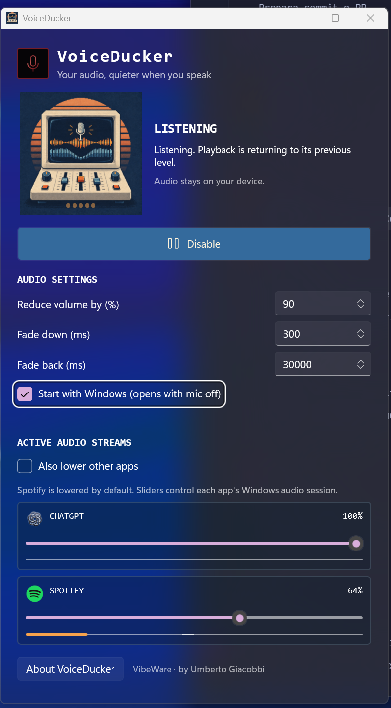
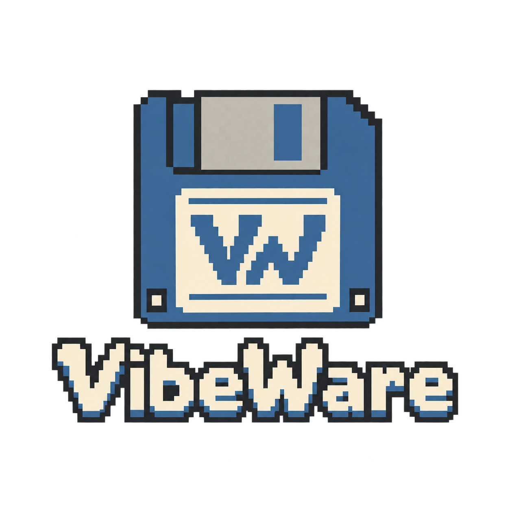

# VoiceDucker

I use AI voice chats a lot, and I got tired of turning down music and other
audio every time I spoke. I wanted one tiny switch: while my microphone picks
up my voice, lower whatever is playing; when I stop, bring it back. I put the
first version together in about fifteen minutes. It is a small personal tool,
and I offer it as is, without guarantees.

I am **Umberto Giacobbi**, the creator of VoiceDucker. This is my MIT-licensed
repository and part of the [VibeWare initiative](https://umbertogiacobbi.biz/vibeware/manifesto).

## Screenshots



The screenshot shows fade back set to 30,000 ms; the first-run default is
5,000 ms.

VoiceDucker watches the default Windows communications microphone **only after
I press Enable**. When its signal crosses a threshold, the app lowers the
volume of Spotify sessions currently playing on active output devices. An
**Also lower other apps** check box includes other active playback sessions. The
reduction is configurable from 0 to 100% (90% by default). Fade down accepts
0 to 5000 ms (300 ms by default), and fade back accepts 0 to 30000 ms
(5000 ms by default). It restores levels it still owns after a short quiet
period. It does not change the system master volume. If I move an app's slider
in the Windows volume mixer, VoiceDucker leaves my new level alone.

The main window shows a microphone-responsive mixer illustration. Its orange
microphone rays are off until capture is enabled, then pulse like a recording
light. The microphone icon changes to a softly pulsing dark red LED. Mixer bars
follow the microphone signal level. Active audio sessions appear below the
settings with each process's Windows icon, a session volume slider and a
playback meter. Moving a slider changes that session's Windows mixer level;
VoiceDucker then releases its claim on the user's new volume. Settings are
saved under the current user's local app data. **Start with Windows** is enabled
on a new installation's first launch; the check box can turn it off later.
The startup choice is remembered on subsequent launches. Existing installations
with saved audio settings keep their Windows startup state. The app opens with
microphone capture still off. Keep the portable folder in a stable location if
this option is enabled.

Closing the window offers **Minimize to tray**, **Close app**, or **Cancel** in
an acrylic window. The tray menu can show or hide the window, enable or disable
ducking, open About, visit the VoiceDucker and VibeWare GitHub repositories,
and close the app. About shows a square promotional illustration. Its Windows
and Spotify imagery is illustrative, not a literal screenshot.

This is a signal-level gate, not speech recognition: a loud room or speakers
feeding into the microphone can trigger it. Headphones help. Microphone data
stays in memory; the app does not record, transmit, or save it. Closing the
window stops capture and attempts to restore changed sessions. If the process
is killed or an audio device disappears, I may need to reset a level manually
in the Windows volume mixer.

## Build and try it

On Windows 11, with the .NET 10 SDK and Windows App SDK build tools:

```powershell
.\scripts\build.ps1 -Architecture x64 -Configuration Debug -Run
```

Each build clears the selected app output and intermediate build directories,
then restores locked packages and publishes a complete portable folder. The
stable executable paths are `artifacts/app/win-x64/VoiceDucker.exe` and
`artifacts/app/win-arm64/VoiceDucker.exe`. All build and generated files are
under `artifacts/`. To build without launching, omit `-Run`. The script refuses
to replace the files of a running portable instance.

Allow desktop app microphone access in Windows if needed. Start some audio,
press **Enable**, speak, then press **Disable** to stop. The signal threshold is
fixed for now, so I do not promise it will suit every microphone or room.
There is no account, telemetry, network service, or audio recording.

GitHub Actions publishes only unpackaged, self-contained portable ZIP artifacts
for x64 and ARM64. A `v*` tag also attaches those same two ZIPs to a GitHub
Release. Extract the complete ZIP and run `VoiceDucker.exe` from its folder.
The Windows App SDK and .NET runtime files are
included in each ZIP, so the ZIP is larger than the app's source code.

## Local MSIX installer

You can also build a Release MSIX for x64 or ARM64. The signer must have a
code-signing certificate with subject `CN=VibeWare` and a private key in
`Cert:\CurrentUser\My`. Windows must trust that certificate on the target PC.
The private key is never stored in this repository.

```powershell
pwsh -NoProfile -File .\scripts\package-msix.ps1 -Architecture x64 -CertificateThumbprint <thumbprint> -Install
pwsh -NoProfile -File .\scripts\package-msix.ps1 -Architecture ARM64 -CertificateThumbprint <thumbprint>
```

The versioned packages are under `artifacts/msix/release/`. `-Install` installs
only the architecture of the current PC and verifies package version and
status. This local MSIX workflow is separate from GitHub Actions, which still
publishes only the two portable ZIPs. A packaged installation uses Windows'
startup task for **Start with Windows**; the portable build uses the current
user's Run key.

The code uses WinUI 3 and NAudio's Windows Core Audio sessions. I directed the
implementation with OpenAI Codex; the source headers and Git history record
that provenance. The logo in `Assets/vibeware-logo.png` is from the VibeWare
brand repository. VoiceDucker is under the [MIT license](LICENSE).

---

<a href="https://umbertogiacobbi.biz/vibeware/manifesto">
  
</a>

### This is VibeWare

VibeWare is a term coined by [Umberto Giacobbi](https://umbertogiacobbi.biz) and an open initiative for developers who build with AI and care about the craft. It challenges the assumption that vibe coding is synonymous with low-quality code. It openly acknowledges the weaknesses and risks of AI-generated software: experienced developers must guide the process, test carefully, check security and take responsibility for the result. A VibeWare footer simply says: this software was developed with AI, and it deserves to be judged by the quality of the work.

[Read the VibeWare manifesto](https://umbertogiacobbi.biz/vibeware/manifesto)

*You are welcome to explore, adapt and reuse the open-source VibeWare materials under the project license — my contribution to the developer community.*
